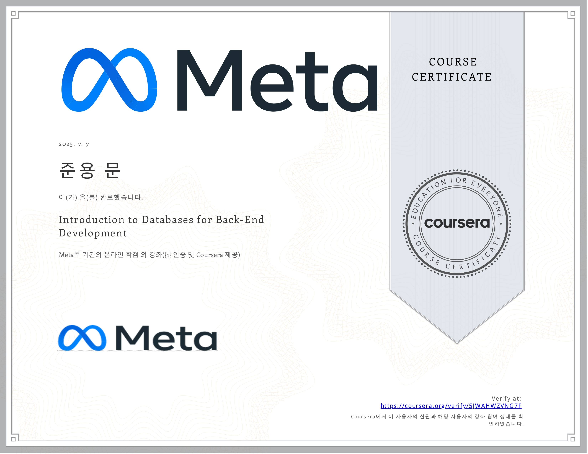

# Introduction to Databases for Back-End Development

## Table of Content

- Week 1: [Introduction to Databases](https://github.com/devFancy/Meta-Backend-Developer/tree/main/Course%204-Introduction%20to%20Databases%20for%20Back-End%20Development/Week%201)
- Week 2: [Create, Read, Update and Delete (CRUD) Operations](https://github.com/devFancy/Meta-Backend-Developer/tree/main/Course%204-Introduction%20to%20Databases%20for%20Back-End%20Development/Week%202)
- Week 3: [SQL Operators and sorting and filtering data]()
- Week 4: [Database design]()
- Week 5: [Graded assessment]()

## Proof of Completion

- [Certification](https://coursera.org/share/5d9196334d1b494d977bfd1aa6043e0d)

