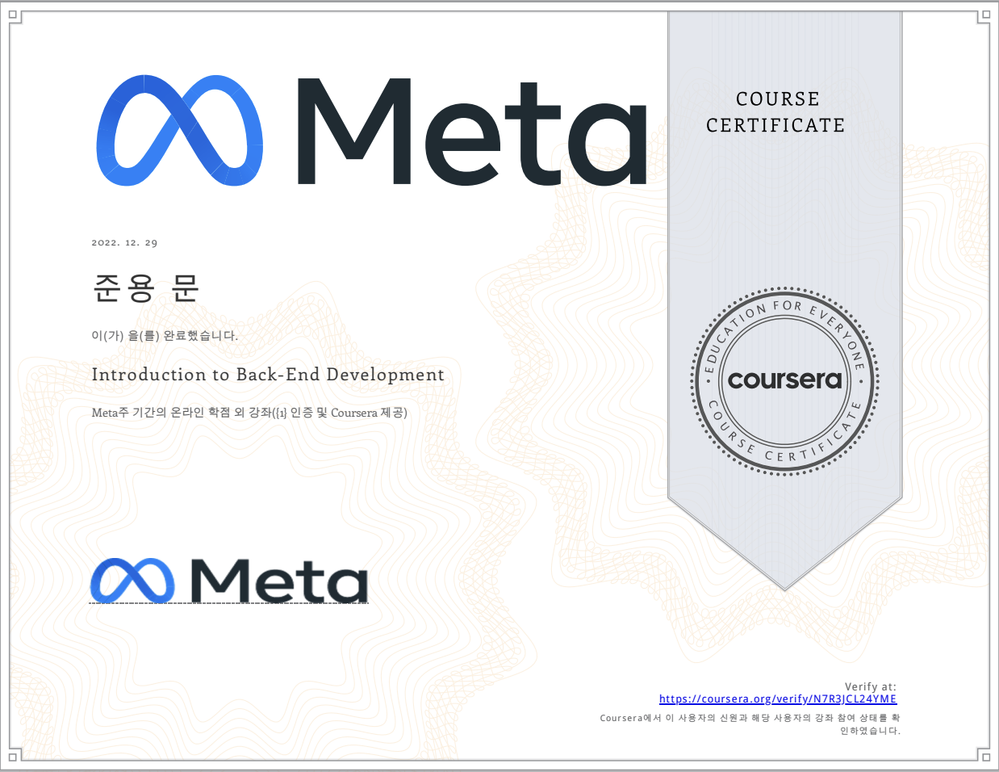

# Introduction to Back-End Development

## Table of Content

- Week 1: Get started with web development
- Week 2: Introduction to HTML and CSS
- Week 3: UI Frameworks
- Week 4: End-of-Course Graded Assessment

## Proof of Completion

- [Certification](https://coursera.org/share/dcebec3982e89ee35c611e4d49a2eaad)

